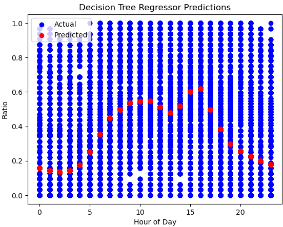
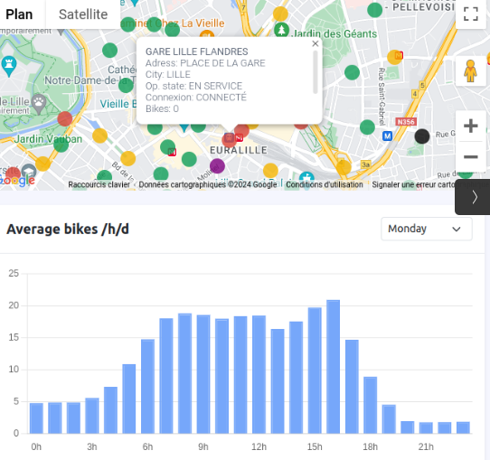

## Machine Learning wih V'lille GCP Dataset


### 1. Data Preparation

```sh
gcloud config list

gcloud projects list
# set project vlille-gcp-etl
gcloud config set project vlille-gcp-etl

bq ls
# get the region and/or location of the dataset
bq show --format=prettyjson vlille-gcp-etl:vlille_dataset
# location US

# create a new dataset vlille_ml_test
bq --location=US mk --dataset vlille-gcp-etl:vlille_ml_test

# copy the data from vlille_dataset.stations to vlille_ml_test.stations
bq cp vlille-gcp-etl:vlille_dataset.stations vlille-gcp-etl:vlille_ml_test.stations

# copy the data from vlille_dataset.records to vlille_ml_test.records
bq cp vlille-gcp-etl:vlille_dataset.records vlille-gcp-etl:vlille_ml_test.records

# assuming the json schema of the records table:
[
    {"name": "station_id",          "type": "INT64"},
    {"name": "etat",                "type": "STRING"},
    {"name": "nb_velos_dispo",      "type": "INT64"},
    {"name": "nb_places_dispo",     "type": "INT64"},
    {"name": "etat_connexion",      "type": "STRING"},
    {"name": "derniere_maj",        "type": "TIMESTAMP"},
    {"name": "record_timestamp",    "type": "TIMESTAMP"}
]

# remove duplicates from the records table
bq query --use_legacy_sql=false 'CREATE OR REPLACE TABLE vlille-gcp-etl.vlille_ml_test.records AS SELECT * FROM (SELECT *, ROW_NUMBER() OVER (PARTITION BY station_id, record_timestamp ORDER BY derniere_maj DESC) AS rn FROM vlille-gcp-etl.vlille_ml_test.records) WHERE rn = 1'


# featuring the records table
bq query --use_legacy_sql=false --destination_table=vlille-gcp-etl:vlille_ml_test.test_ml_3 '
SELECT
    station_id,
    EXTRACT(DAYOFWEEK FROM record_timestamp) AS day_of_week,
    EXTRACT(HOUR FROM record_timestamp) AS hour_of_day,
    IF(nb_velos_dispo + nb_places_dispo > 0, nb_velos_dispo / (nb_velos_dispo + nb_places_dispo), NULL) AS ratio_velos_dispo
FROM
    `vlille-gcp-etl.vlille_ml_test.records`
WHERE
    station_id = 25
'


bq extract --destination_format=CSV vlille-gcp-etl:vlille_ml_test.test_ml_3 gs://vlille-gcp-etl-data/test_ml_3.csv

gsutil cp gs://vlille-gcp-etl-data/test_ml_3.csv test_ml_3.csv

# --> test_ml_3.csv
```

### 2. Data Prediction with decision tree

Jupyter notebook [nb.ipynb](nb.ipynb) :

```python
import pandas as pd
from sklearn.model_selection import train_test_split
from sklearn.linear_model import LinearRegression
from sklearn.metrics import mean_squared_error, r2_score
from sklearn.tree import DecisionTreeRegressor
import matplotlib.pyplot as plt

# ===== Data preparation ===============================
# Load the dataset
data = pd.read_csv('test_ml_3.csv')

# Split data into features (X) and target variable (y)
X = data[['hour_of_day']]
y = data['ratio_velos_dispo']

# Split the data into training and testing sets
X_train, X_test, y_train, y_test = train_test_split(X, y, test_size=0.2, random_state=42)

# ===== model training and prediction ===================
# Create a decision tree regressor model
tree_model = DecisionTreeRegressor(random_state=42)

# Train the model using the training sets
tree_model.fit(X_train, y_train)

# Make predictions using the testing set
y_pred_tree = tree_model.predict(X_test)

# Print the mean squared error
print('Mean squared error (Decision Tree):', mean_squared_error(y_test, y_pred_tree))

# Print the coefficient of determination: 1 is perfect prediction
print('Coefficient of determination (Decision Tree):', r2_score(y_test, y_pred_tree))

# Mean squared error (Decision Tree): 0.06628563830003001
# Coefficient of determination (Decision Tree): 0.29758676949349205

# ===== Plot the results ===============================
import matplotlib.pyplot as plt

# Plot the actual values
plt.scatter(X_test, y_test, color='blue', label='Actual')

# Plot the predicted values
plt.scatter(X_test, y_pred_tree, color='red', label='Predicted')

plt.title('Decision Tree Regressor Predictions')
plt.xlabel('Hour of Day')
plt.ylabel('Ratio')
plt.legend()

plt.show()
```

### 3. Prediction visualization

Seems to be a good fit for the decision tree model considering the low coefficient of determination and similarity with average values.

## Decision Tree prediction



## Average bikes on Monday



